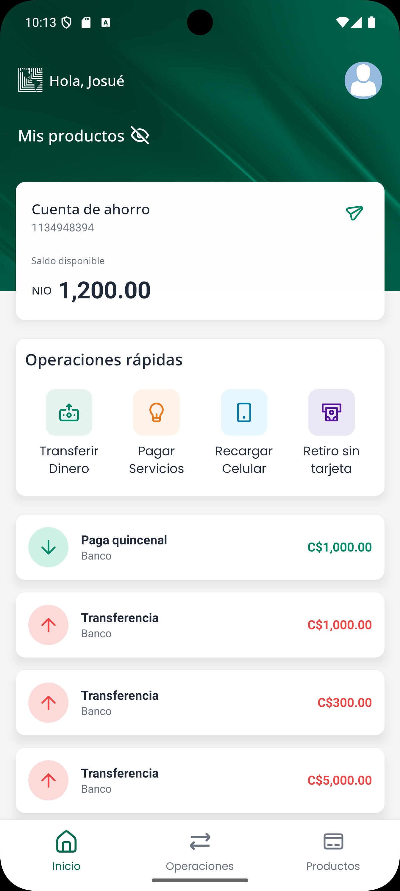

# Lafise Challenge Mobile

Este proyecto es una aplicación móvil desarrollada con React Native y Expo como parte del "Lafise Challenge". La aplicación consume una API mock para simular funcionalidades bancarias básicas.

## Tabla de Contenidos

-   [Visión General](#visión-general)
-   [Características Principales](#características-principales)
-   [Tecnologías Utilizadas](#tecnologías-utilizadas)
-   [Estructura del Proyecto](#estructura-del-proyecto)
-   [Prerrequisitos](#prerrequisitos)
-   [Configuración y Puesta en Marcha](#configuración-y-puesta-en-marcha)
    -   [1. Configurar la API Mock](#1-configurar-la-api-mock)
    -   [2. Configurar la Aplicación Móvil](#2-configurar-la-aplicación-móvil)
-   [Ejecutar la Aplicación](#ejecutar-la-aplicación)
-   [Scripts Disponibles](#scripts-disponibles)
-   [Screenshot del App](#imágenes-del-app)
-   [Desarrollador](#desarrollador)

## Visión General

La aplicación móvil permite a los usuarios visualizar información de cuentas, realizar transferencias simuladas y ver un historial de operaciones. Está construida con un enfoque moderno utilizando Expo Router para la navegación y NativeWind para el estilizado, facilitando un desarrollo ágil y una experiencia de usuario fluida.

## Características Principales

*   Navegación basada en archivos con Expo Router.
*   Estilizado con clases de utilidad mediante NativeWind.
*   Manejo de estado global con Zustand.
*   Comunicaciones HTTP con Axios.
*   Interfaz de usuario intuitiva y responsiva.

## Tecnologías Utilizadas

*   **React Native**
*   **Expo:** (Referencia general: 53.0.9)
    *   **Expo Router:** 5.0.6
*   **NativeWind:** 4.1.23
*   **Axios**
*   **Zustand:** 5.0.4
*   **TypeScript**

## Estructura del Proyecto
```bash
├── .expo/ # Archivos generados por Expo
├── android/ # Código nativo específico de Android
├── api/ # Configuración de Axios para la API
│ └── axios.ts
├── app/ # Rutas y pantallas de la aplicación (Expo Router)
│ ├── (tabs)/ # Grupo de rutas para las pestañas principales
│ │ ├── _layout.tsx
│ │ ├── index.tsx # Pantalla principal/Home
│ │ ├── operations.tsx
│ │ └── products.tsx
│ ├── (transfer)/ # Grupo de rutas para el flujo de transferencia
│ ├── _layout.tsx # Layout principal de la app
│ ├── +html.tsx # Configuración HTML para web (si aplica)
│ └── +not-found.tsx # Pantalla para rutas no encontradas
├── assets/ # Imágenes, fuentes y otros recursos estáticos
├── components/ # Componentes reutilizables de la UI
│ ├── tests/ # Pruebas para componentes
│ ├── common/ # Componentes genéricos (Button, Card, etc.)
│ ├── home/ # Componentes específicos de la pantalla Home
│ └── transfer/ # Componentes específicos del flujo de Transferencia
├── constant/ # Constantes de la aplicación (NOTA: singular, como se especificó)
│ ├── Colors.ts
│ └── Constant.tsx # Aquí se configura la API_URL (NOTA: singular)
├── stores/ # Stores de Zustand para el manejo de estado
│ ├── accounts.store.ts
│ ├── transactions.store.ts
│ └── user.store.ts
├── utils/ # Funciones de utilidad
│ ├── formatCurrency.ts
│ └── SharingAccount.ts
├── .gitignore
├── app.json # Configuración de la aplicación Expo
├── babel.config.js
├── expo-env.d.ts
├── global.css # Estilos globales (usados por NativeWind)
├── metro.config.js
├── nativewind-env.d.ts
├── package-lock.json
├── package.json
├── postcss.config.js
└── tailwind.config.js # Configuración de Tailwind CSS para NativeWind
```
## Prerrequisitos

Antes de comenzar, asegúrate de tener instalado lo siguiente:
*   Node.js (v18 LTS o superior recomendado)
*   npm (o yarn)
*   Git
*   Un emulador de Android configurado o un dispositivo Android físico.
*   Opcional: La aplicación Expo Go en tu dispositivo físico si planeas usar el escaneo QR.

## Configuración y Puesta en Marcha

Sigue estos pasos para configurar y ejecutar el proyecto localmente.

### 1. Configurar la API Mock

La aplicación móvil depende de una API mock para funcionar.

1.  Clona el repositorio de la API mock:
    ```bash
    git clone https://github.com/lafise/mobile-frontend-challenge-mock.git
    ```
2.  Navega al directorio de la API mock:
    ```bash
    cd mobile-frontend-challenge-mock
    ```
3.  Sigue las instrucciones del `README.md` de ese repositorio para instalar dependencias y levantar el servidor de la API. Generalmente, esto implicará comandos como `npm install` y `npm start`.

### 2. Configurar la Aplicación Móvil

1.  Clona este repositorio:
    ```bash
    git clone https://github.com/JCFlores915/lafise-challenge-mobile.git
    ```
2.  Navega al directorio del proyecto:
    ```bash
    cd lafise-challenge-mobile
    ```
3.  Instala las dependencias del proyecto:
    ```bash
    npm install
    ```
    o si prefieres yarn:
    ```bash
    yarn install
    ```
4.  **Configurar la URL de la API:**
    *   Obtén la dirección IP local de tu PC/laptop donde está corriendo la API mock.
        *   En Windows: `ipconfig` en la consola.
        *   En macOS/Linux: `ifconfig` o `ip addr` en la terminal.
    *   Abre el archivo `constant/Constant.tsx` en tu editor de código. (Ruta: `constant/Constant.tsx`)
    *   Modifica la variable `API_URL` para que apunte a la dirección IP de tu máquina y al puerto de la API mock. Por ejemplo:
        ```typescript
        // constant/Constant.tsx
        export const API_URL = 'http://TU_IP_ORDENADOR:5566';
        // Ejemplo: export const API_URL = 'http://192.168.1.10:5566';
        ```

## Ejecutar la Aplicación

Una vez que la API mock esté en ejecución y hayas configurado la `API_URL` en la aplicación móvil:

1.  Asegúrate de que tu emulador de Android esté corriendo o tu dispositivo físico esté conectado y configurado para depuración USB.
2.  Desde la raíz del proyecto `lafise-challenge-mobile`, ejecuta:

    ```bash
    npm run android
    ```
    Esto compilará la aplicación y la instalará en tu emulador/dispositivo Android.

3.  Alternativamente, si deseas usar la aplicación Expo Go:
    ```bash
    npm start
    ```
    o
    ```bash
    npx expo start
    ```
    Esto iniciará el Metro Bundler y mostrará un código QR. Escanea este código QR con la aplicación Expo Go en tu dispositivo Android. Asegúrate de que tu dispositivo y tu computadora estén en la misma red Wi-Fi.

## Scripts Disponibles

En el directorio del proyecto, puedes ejecutar:

*   `npm start` o `npx expo start`: Inicia el Metro Bundler, permitiéndote ejecutar la app en Expo Go o en emuladores/dispositivos.
*   `npm run android` o `npx expo run:android`: Compila y ejecuta la app en un emulador o dispositivo Android conectado.
*   `npm run ios` o `npx expo run:ios`: Compila y ejecuta la app en un emulador o dispositivo iOS conectado (requiere macOS).
*   `npm run web` o `npx expo start --web`: Ejecuta la versión web de la aplicación (si está configurada).

## Imágenes del App

1. **Tabs (Inicio, Operaciones, Productos)**




2. **Flujo de Transaccion**


3. **Network Error**


## Desarrollador

Este proyecto fue desarrollado por:

*   **Nombre:** Juan Carlos Flores Gutierrez